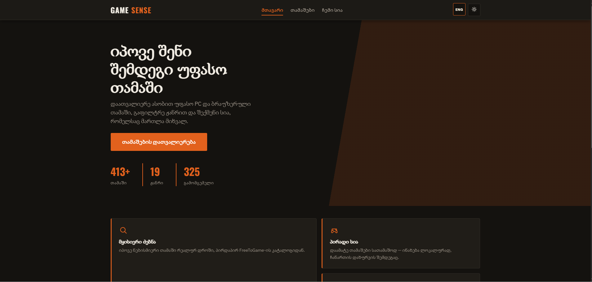
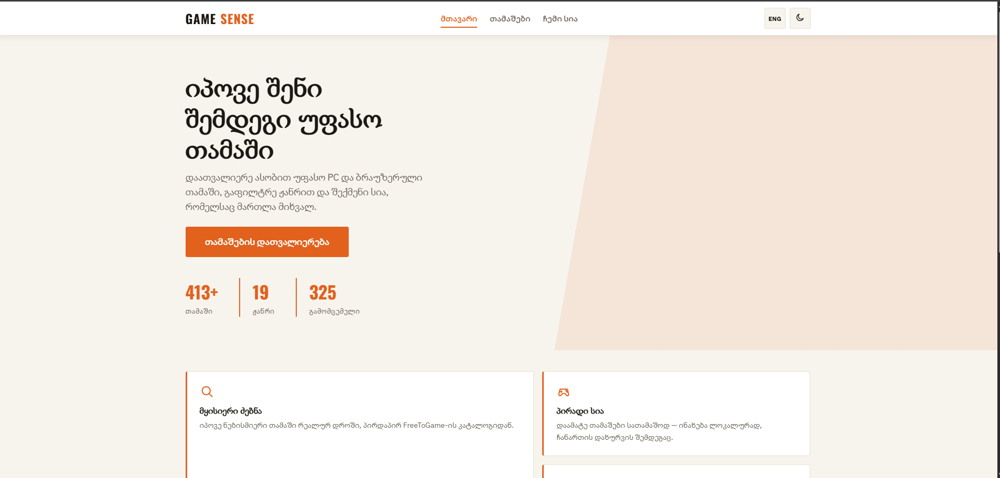
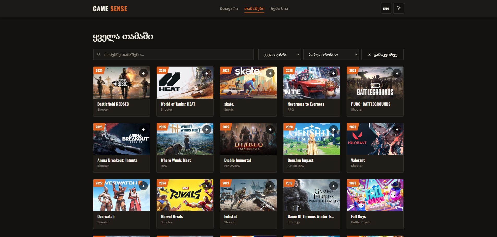
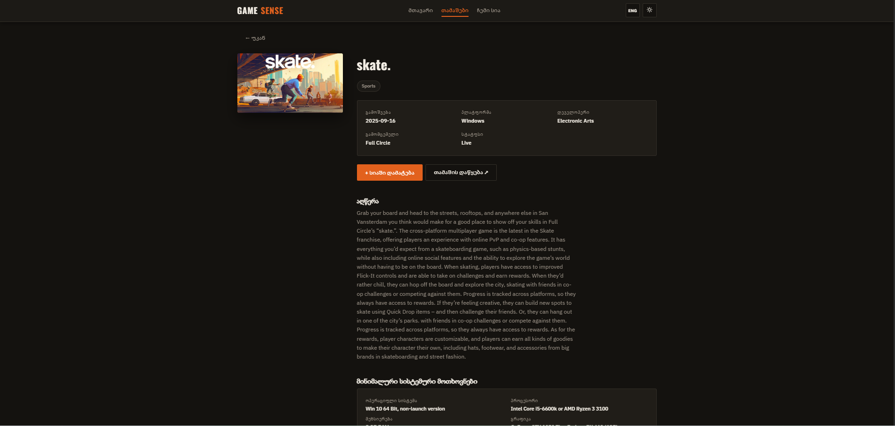
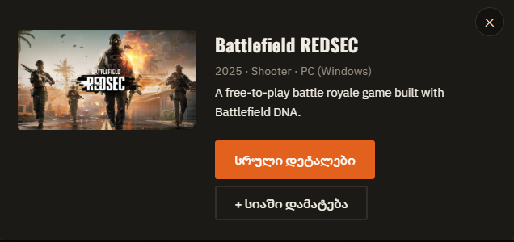
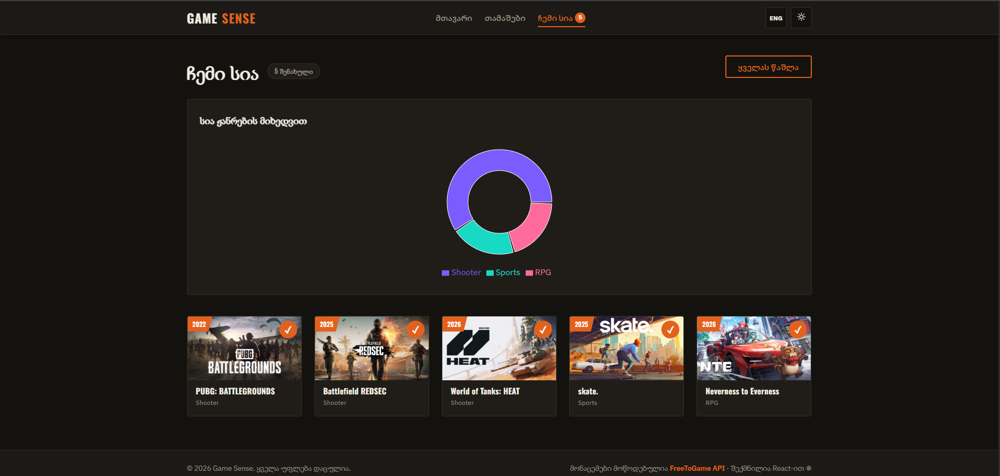
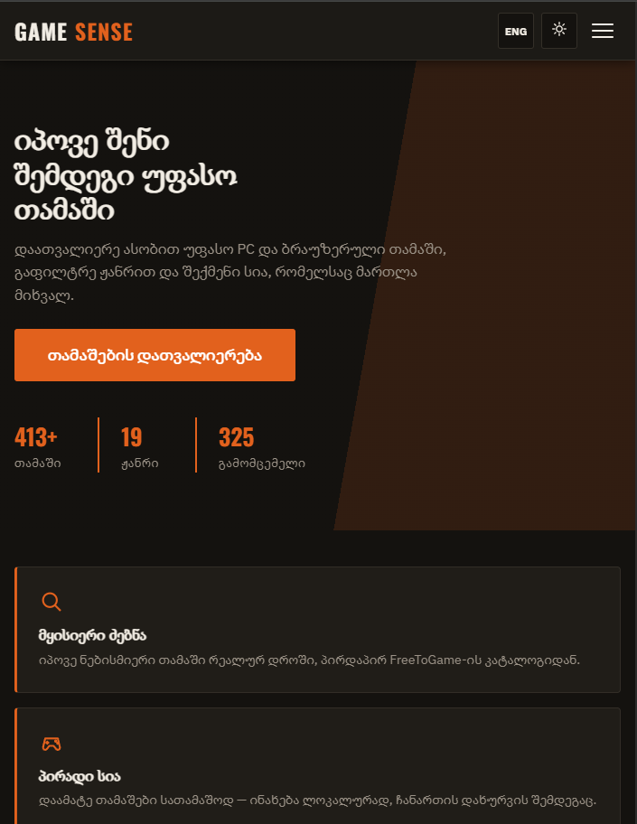

# Game Sense

**Game Sense** — რეაქტზე აგებული რესპონსივი ვებ აპლიკაცია, სადაც შეგიძლია აღმოაჩინო უფასო (free-to-play) ვიდეო თამაშები და შექმნა შენი პირადი სია რას ითამაშებ შემდეგ. დაათვალიერე ასობით PC და ბრაუზერული თამაში FreeToGame-ის კატალოგიდან, გაფილტრე ჟანრით, ნახე სრული დეტალები — სისტემური მოთხოვნები და სქრინშოთები — და დაამატე თამაშები შენს სიაში, რომლის ჟანრული განაწილებაც გრაფიკზეც კი გამოისახება.


 **Live საიტი:** [gameesense.netlify.app](https://gameesense.netlify.app/)

---

## ფუნქციონალი

-  **5 გვერდი** — მთავარი, თამაშები, თამაშის დეტალები, ჩემი სია, 404 (React Router)
-  **ცოცხალი ძებნა** დებაუნსით (500ms), ჟანრით ფილტრაციასთან და დახარისხებასთან ერთად (პოპულარობით / სახელით / გამოშვების თარიღით)
-  **გამაკვირვე** — შემთხვევით თამაშს ირჩევს მიმდინარე შედეგებიდან და სწრაფი ნახვის ფანჯარაში აჩვენებს
-  **ჩემი სია** — შეინახე თამაშები სათამაშოდ, ინახება `localStorage`-ში
-  **ჟანრების გრაფიკი** შენი შენახული სიის მიხედვით, აგებულია Recharts-ით
-  **მინიმალური სისტემური მოთხოვნები და სქრინშოთები** დეტალების გვერდზე
-  **ბოლო საძიებო მოთხოვნა** — ინახება `sessionStorage`-ში
-  **მოდალური ფანჯრები** — სწრაფი ნახვა ბარათებზე + დადასტურების ფანჯარა (React Portals-ით აგებული)
-  **მუქი / ღია თემა** — ინახება `localStorage`-ში, გამოიყენება CSS ცვლადებით
-  **ორი ენა** — ინგლისური / ქართული (საკუთარი i18n Context API-ით)
-  **სრულად რესპონსივი** — მუშაობს Chrome DevTools-ის ყველა მოწყობილობის პრესეტზე (320px-დან)
-  **ანიმაციები** — გვერდების გადასვლა, ბარათების თანმიმდევრული გამოჩენა, hover ეფექტები, ანიმირებული მოდალები, სპინერი (და პატივს სცემს `prefers-reduced-motion`-ს)
-  **Route-level code splitting** — `React.lazy` + `Suspense`

## გამოყენებული ტექნოლოგიები

| ტექნოლოგია | დანიშნულება |
|---|---|
| [React 18](https://react.dev/) | UI ბიბლიოთეკა (მხოლოდ ფუნქციური კომპონენტები) |
| [Vite](https://vitejs.dev/) | build ხელსაწყო და dev სერვერი |
| [React Router v6](https://reactrouter.com/) | კლიენტის მხარის routing |
| [Axios](https://axios-http.com/) | HTTP კლიენტი API მოთხოვნებისთვის |
| [Recharts](https://recharts.org/) | ჟანრების გრაფიკი "ჩემი სია" გვერდზე |
| [SASS (SCSS)](https://sass-lang.com/) | CSS პრეპროცესორი, 7-1 არქიტექტურის მიხედვით |
| [FreeToGame API](https://www.freetogame.com/api-doc) | თამაშების კატალოგი, დეტალები და სქრინშოთები — API გასაღები არ სჭირდება |

### გამოყენებული React ფუნქციონალი

- **Hooks:** `useState`, `useEffect`, `useContext`, `useReducer`, `useMemo`, `useCallback`, `useRef`
- **საკუთარი hooks:** `useLocalStorage`, `useSessionStorage`, `useDebounce`, `useFetch`
- **Context API:** `ThemeContext`, `LanguageContext`, `BacklogContext`
- **React Portals** მოდალებისთვის, **`React.lazy` / `Suspense`** code splitting-ისთვის, **`memo`** რენდერის ოპტიმიზაციისთვის

## გაშვების ინსტრუქცია

\`\`\`bash
# 1. დააკლონირე რეპოზიტორია
git clone https://github.com/Gamoo12/React-Final-Project-GameSense-.git
cd React-Final-Project-GameSense-

# 2. დააინსტალირე დამოკიდებულებები
npm install

# 3. გაუშვი dev სერვერი (API გასაღები არ სჭირდება)
npm run dev
# → გახსენი http://localhost:5173

# 4. საბოლოო build (შედეგი /dist ფოლდერში)
npm run build
\`\`\`

## სქრინშოთები

| მთავარი (მუქი) | მთავარი (ღია) |
|---|---|
|  |  |

| თამაშები + ძებნა | თამაშის დეტალები |
|---|---|
|  |  |

| სწრაფი ნახვა | ჩემი სია + გრაფიკი | მობილური |
|---|---|---|
|  |  |  |

## პროექტის სტრუქტურა

```
game-sense/
├── public/                  # სტატიკური ფაილები (favicon, _redirects)
├── src/
│   ├── api/                 # axios ინსტანსი + FreeToGame API ფუნქციები
│   │   └── gamesApi.js
│   ├── components/
│   │   ├── layout/          # Header, Footer
│   │   ├── games/           # GameCard, GameGrid, SearchBar, QuickViewModal
│   │   ├── charts/          # GenreBreakdownChart (Recharts)
│   │   └── ui/               # Modal, Loader, ThemeToggle, LanguageSwitcher, ScrollToTop
│   ├── context/               # Theme, Language, Backlog providers
│   ├── hooks/                 # useLocalStorage, useSessionStorage, useDebounce, useFetch
│   ├── i18n/                   # EN / KA თარგმანები
│   ├── pages/                  # HomePage, GamesPage, GameDetailsPage, BacklogPage, NotFoundPage
│   ├── styles/                  # SCSS: abstracts / base / components / pages
│   ├── App.jsx                   # routes
│   └── main.jsx                    # entry, providers
├── index.html
├── package.json
└── vite.config.js
```

##  API

მონაცემები მოდის უფასო, გასაღების გარეშე [FreeToGame API](https://www.freetogame.com/api-doc)-დან:

- `GET /api/games?sort-by=popularity` — თამაშების სრული კატალოგი (ჟანრი, პლატფორმა, გამომცემელი, გამოშვების თარიღი, სურათი, მოკლე აღწერა)
- `GET /api/game?id=` — თამაშის სრული დეტალები: აღწერა, სქრინშოთები, მინიმალური სისტემური მოთხოვნები და თამაშის ლინკი

ჟანრით ფილტრაცია, ძებნა და დახარისხება ხდება კლიენტის მხარეს, უკვე ჩამოტვირთულ კატალოგზე.

##  ლიცენზია

საგანმანათლებლო პროექტი. თამაშების მონაცემები © [FreeToGame](https://www.freetogame.com/).
